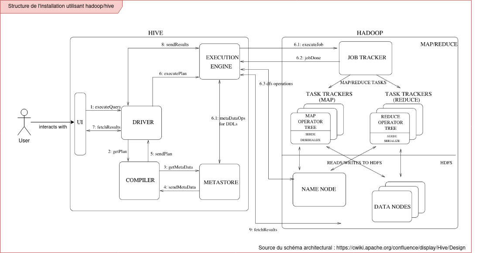

# Projet CASI

Projet réalisé dans le cadre de l'EC CASI. Le but est d'utiliser les principes de big data pour classer des tweets issus du monde réel. 

## Techno utilisées

 * Hadoop
 * Hive
 
## Architecture de la solution proposée

